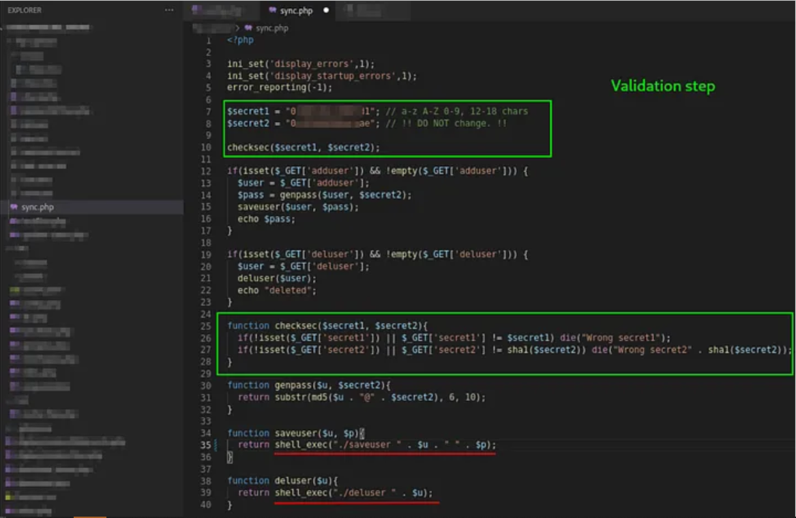

# $10.000 bounty for exposed .git to RCE

### 1. Recon
Using chain of tools:
```
amass enum -active -d $1 -brute -w ~/SecLists/Discovery/DNS/subdomains-top1million-110000.txt -o amass.txt
cat amass.txt | aquatone -ports xlarge -out aqua_$1
nuclei -l aqua_$1/aquatone_urls.txt -t ~/nuclei-templates -es info -o nuclei_$1.txt
```
Fortunately, the output of nuclei showed me the exposed .git/ directories:<br>
<br>
Using the git-dumper tool to download the source:
```
git-dumper http://example.com/.git/ output
```
<br>&nbsp;

### 2. Did not Rush
I thought this was a great opportunity to look for serious issues in the code and did not rush to report exposed .git<br>
And so it turned out that in the code they used a call to local bash scripts to save and delete ftp users via the shell_exec() function, which took an unfiltered userinput, which led to the RCE vulnerability<br>
<br>&nbsp;

### 3. Preparing Exploit
To craft the request, I also had to take into account a simple validation that required hardcoded secret keys<br>

<br>&nbsp;

### 4. Final Result
And the final result:
`http://example.com/ftp-upload/sync.php?deluser=INJECTION&secret1=[secret1]&secret2=[sha1 encoded secret2]`

<br>&nbsp;

## Credit
Based on [Lev Shmelev](https://medium.com/@levshmelevv/10-000-bounty-for-exposed-git-to-rce-304c7e1f54)'s writeup.
<br>&nbsp;

## Support
You can Follow [me](https://twitter.com/MeAsHacker_HNA) on twitter or
<br><br><a href="https://www.buymeacoffee.com/NafisiAslH" target="_blank"></a>
